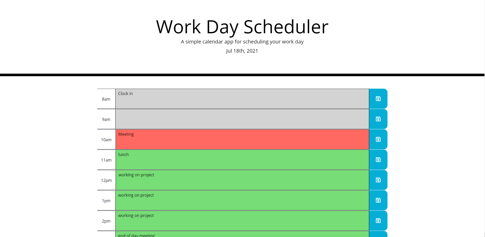

# Work Day Scheduler Starter Code

This application is designed to allow the user to input daily events into a schedule.
It will display the current day at the top and when the user clicks on the the empty
space between the hour and save icon, they can enter those events. Once they type it 
in they can then hit the save put so that when the either leave the page or they refresh
the data persists.

## Languages and API's

* HTML
* CSS
* Javascript (Jquery)

###

* Bootstrap
* Google Fonts
* Font Awesome
* Moment.js

## Screenshot

